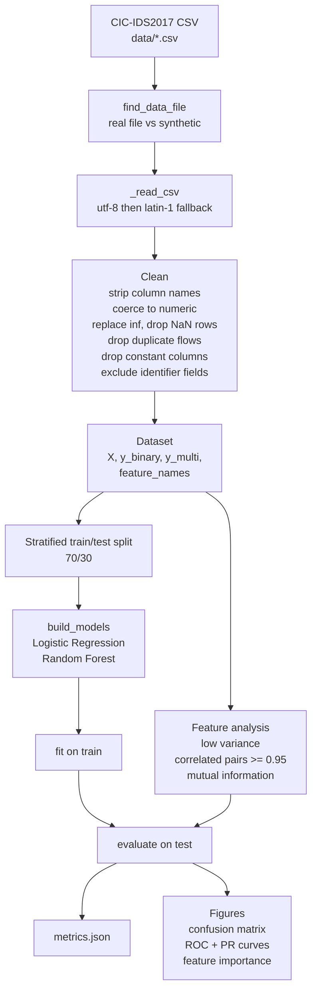
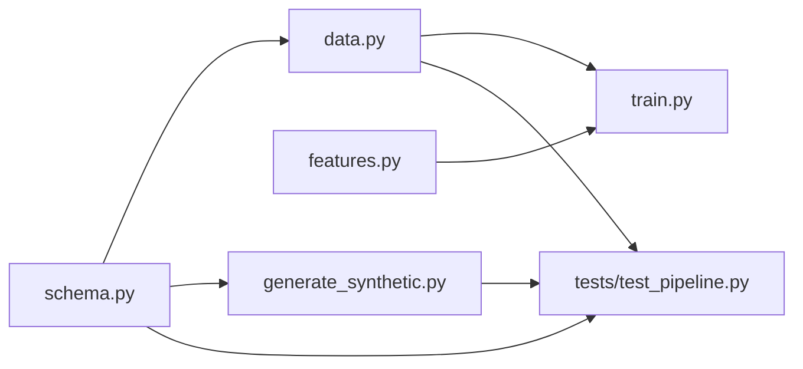

# Architecture

This document describes how the web-attack-detection pipeline is structured,
how data flows through it, and what each source file does.

## Overview

The pipeline turns a labeled CIC-IDS2017 flow CSV into trained attack
detectors and an evaluation report. It is organized as four small,
single-responsibility modules under `src/`, plus an optional synthetic data
generator and an invariant test suite. The design separates concerns so each
stage is independently testable: schema definition, data loading and cleaning,
feature analysis, and training and evaluation.

```
src/
  schema.py              canonical feature names + label helpers
  data.py                load + clean -> Dataset
  features.py            variance / correlation / mutual-information analysis
  train.py               split, train baselines, evaluate, write artifacts
  generate_synthetic.py  optional offline stand-in dataset
tests/
  test_pipeline.py       invariant tests on a tiny synthetic sample
data/                    input CSVs (real file or synthetic)
outputs/                 metrics.json and figures, per task
```

## Pipeline data flow



## Module dependencies



`train.py` and `generate_synthetic.py` are the two command-line entry points.
`schema.py` has no internal dependencies and is imported everywhere a feature
name or label rule is needed.

## Source files

### `src/schema.py`

The single source of truth for the dataset contract. It has no dependencies on
the other modules.

- `FEATURE_COLUMNS`: the 78 CICFlowMeter flow features in canonical
  whitespace-stripped form. The loader selects columns by this list, which is
  what keeps identifier fields (Source IP, Timestamp, and similar) out of the
  model.
- `LABEL_COLUMN`, `BENIGN_LABEL`: the label column name and the benign class
  string.
- `REAL_CLASS_COUNTS`: documented per-class row counts for the real
  web-attacks file, used by the synthetic generator to reproduce the imbalance.
- `normalise_label(label)`: collapses the en-dash and hyphen variants the raw
  file ships with (latin-1 `\x96` and unicode `\u2013`) and squashes
  whitespace, so `"Web Attack \x96 XSS"` becomes `"Web Attack - XSS"`.
- `is_attack(label)`: True for any web-attack subclass. Retained for the
  web-attack framing and tests. The loader itself uses the more general
  non-benign rule so the pipeline also works on other day-files.

### `src/data.py`

Loading and cleaning. Produces the immutable `Dataset` container the rest of
the pipeline consumes.

- `Dataset` (dataclass): holds `X` (numeric feature frame), `y_binary`
  (0 benign, 1 attack), `y_multi` (normalised class labels), `feature_names`,
  `source_path`, and `is_synthetic`.
- `find_data_file(data_dir)`: returns the first real CSV in `data/`, or the
  synthetic stand-in if no real file is present. Any `.csv` other than the
  synthetic file is treated as real, so dropping in the Thursday web-attacks
  file or the Friday DDoS capture both work without code changes.
- `_read_csv(path)`: reads with a utf-8 then latin-1 encoding fallback, because
  the real file uses latin-1 for the en-dash in attack labels.
- `load_dataset(data_dir, path)`: the main entry. Strips column names, selects
  the schema features, coerces them to numeric, replaces infinities with NaN,
  drops rows with any non-finite feature (this removes the roughly 288k empty
  rows in the TrafficLabelling export), drops exact duplicate flows, drops
  constant columns, and builds both targets. The binary target is defined as
  any non-benign label, which keeps the loader file-agnostic.
- `class_distribution(ds)`: convenience value-count over `y_multi`.

### `src/features.py`

Cheap, reported feature diagnostics. These justify the feature set; they do not
mutate the data beyond what the loader already pruned.

- `low_variance_columns(X, threshold=1e-8)`: near-constant columns that add no
  signal.
- `correlated_pairs(X, threshold=0.95)`: feature pairs above the correlation
  threshold, sorted by strength. Surfaces the heavy redundancy in CICFlowMeter
  output (byte totals, segment sizes, header-length variants move together).
- `mutual_information(X, y, sample=50000, seed=0)`: per-feature mutual
  information against the label, subsampled for speed, returned sorted.

### `src/train.py`

The orchestration and evaluation entry point.

- `build_models(task)`: returns the baseline pipelines. Logistic Regression
  wrapped in a `StandardScaler` with `class_weight=balanced`, and a Random
  Forest (200 trees) with `class_weight=balanced_subsample`. Both use class
  weighting to counter imbalance.
- `evaluate(name, model, X_test, y_test, labels, task, outdir)`: computes the
  classification report, confusion matrix, and for the binary task ROC-AUC and
  PR-AUC, then triggers the plots. Returns a metrics dict.
- `_plot_confusion`, `_plot_curves`, `_plot_importance`: figure helpers. The
  importance plot shows Random Forest importances next to mutual information.
- `run(args)`: wires the stages together. Loads data, prints the class
  distribution and feature analysis, performs the stratified split, trains the
  selected models, evaluates them, and writes `metrics.json` plus figures to
  the output directory.
- `main()`: argument parsing. Flags are `--data-dir`, `--path`, `--task`
  (`binary` or `multiclass`), `--model` (`all`, `logistic_regression`,
  `random_forest`), `--test-size`, and `--outdir`.

### `src/generate_synthetic.py`

Optional offline fallback so the pipeline and tests run without the real
download. It reproduces the 79-column schema, the four real class labels, and
the documented imbalance, with deliberately overlapping class-conditional
features so minority classes stay hard. Numbers from this file are illustrative
only and are not real CIC-IDS2017 results.

- `_block(rng, n, shift)`: builds one class block. Background columns are
  flow-like noise; a small set of signal features get a class-dependent mean
  shift.
- `generate(scale, seed)`: assembles all classes, injects the realistic
  messiness (a few infinities, NaNs, and duplicate rows), and shuffles.
- `main()`: CLI writing `data/synthetic_web_attacks.csv`. Flags are `--out`,
  `--scale`, and `--seed`.

### `tests/test_pipeline.py`

Six invariant tests that run on a tiny synthetic sample, so they are fast and
need no download. They assert label normalisation across dash variants, the
benign vs attack rule, that the loader emits only finite numeric features with
no NaNs, that the binary target is 0/1 with both classes present, that
duplicates are removed, and that feature names stay a subset of the schema.

## Outputs

Each run writes to its `--outdir` (`outputs/binary/` or `outputs/multiclass/`):

- `metrics.json`: source path and synthetic flag, class distribution, feature
  analysis summary, and per-model metrics (accuracy, macro and weighted F1,
  per-class precision/recall/F1, confusion matrix, and for the binary task
  ROC-AUC and PR-AUC).
- `confusion_<model>.png`, `curves_<model>.png` (binary ROC and PR per model),
  and `feature_importance.png`.

## Design invariants

- Features are selected by name from `FEATURE_COLUMNS`, so identifier and
  timestamp columns can never leak into a model.
- The same cleaning path runs for real and synthetic data, so behavior is
  consistent across both.
- After cleaning, the feature matrix is finite, numeric, de-duplicated, and
  free of constant columns. The tests enforce these properties.
- `schema.py` is dependency-free and authoritative; changing the feature
  contract is a one-file edit.
